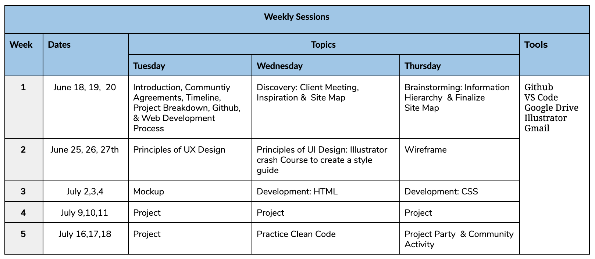

**Season:** Summer 2019

**Description:** This workshop is an interactive and hands-on demonstration of how the web development process works. They will start with website information, images, text, and tools from a client to experience how someone would put it all together to make an appealing web page. The workshop will be a preview of design principles and techniques such as contrast, alignment, color, and proximity while learning Illustrator. The last 2 weeks will focus on bringing the design to life with code. 

#### Timeline:

#### Goal:

By the end of the series, members will be able to create a simple website from scratch using HTML, CSS. They will also get exposed to design principles and programs so they have a holistic view of what it takes to create a website.

#### Project: 
NEST Studios: This website is for the DAT department and the purpose of this website is t house and past, present and future films proejcts created by the DAT dept. The client for this project is Gabe. 
