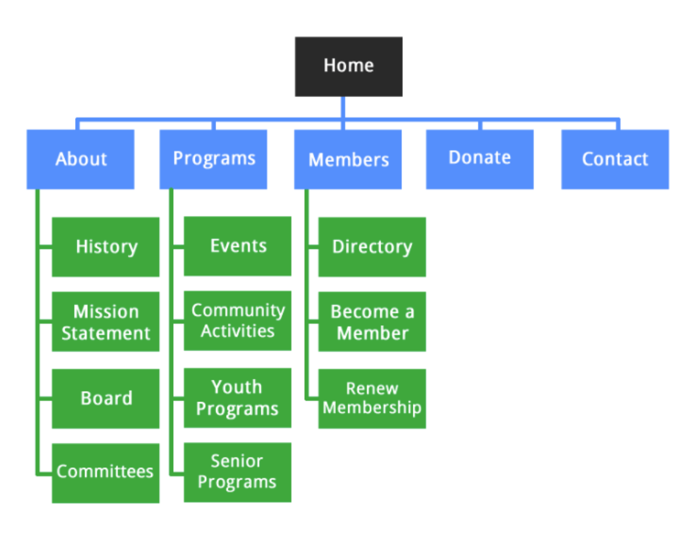

# Create a site map 

**What is a site map?** 
Site map is a list of differenet pages on your webiste that helps you orgnaize that display of those pages. It is helpful because it illustrates the infomration navigation, size of the website, and optimzae SEO. 

It display the parents and child relatohips between the apges on the website. 

This is basic site map that most website have. It all starts with the homepage, at this point you need to ask yourself, what content do you have that could be housed linked to the homepage? 

## Steps to Create a Site Map: 

### Step 1: Review Your Content 

In this step look at your existing content you have at hand a begin to form the second layer on your site map the menu. 

It is important to aim to create a sitemap that has a shallow depth, meaning it only takes three clicks to navigate to any page on your website.

While doing this step always think about the audience. Image yourself as visitor and you want to find a specific piece of information. How you can you get to the information in under 3 clicks? 

### Step 2: Priortize your content

Create a hierarchy of pages based on importance and how you want them to be indexed. Prioritize your content into tiers that follow a logical hierarchy. 
