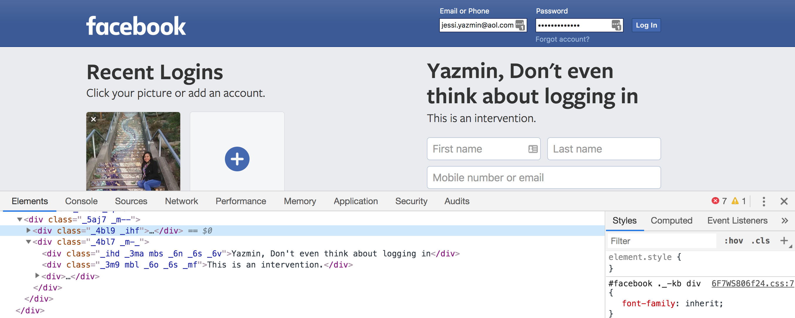
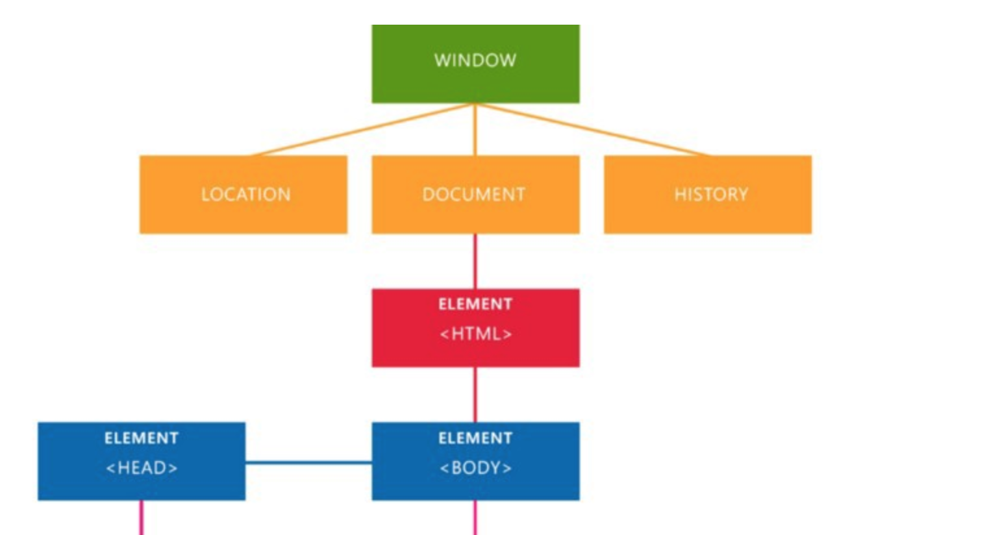

## Instructors
Makes sure you go over EVERY topic in here. The foundations are REALLY important. The order in which it's done is also intentional. Please try to keep the order. If you feel like putting things in a different order is easier to understand, please log it somewhere. Do NOT skip concepts. The best way to prepare is to do a website yourself.

## Before you start coding

### Set up your local environment
* Local means your page will be on your computer and you can only get to it from your computer by clicking on the page. 
* Nobody else can see your page from the browser, unless they have your file on their computer. 
* We will be making a website that is a tribute to your favorite game or a favorite level or world you’ve built in a game, maybe even a game you’ve built.
* Start by making a folder for your website somewhere on your computer- remember where it is! 
  * Since we want to set up good habits, we recommend that you name things with names that make sense so you can find them later and know what is in those files. 
  * Example of good naming my-favorite-game-site (avoid spaces in your folder name) 

### Setting up a directory 
* The folder you just made is called a root folder
  * Your root folder is the main folder where all your files live. This is very important to note. 
* Make subfolders for your images and icons 
  * For organization sake, I like to have separate folders for images and icons.
  * These will come in handy later. 

### Getting to know your tools
* <b>Text editor</b>
  * This is where you will be writing your code and saving the file with the correct extension so the computer is able to read it. You will be making a lot of files with .html at the end. This is how a browser knows how to read your file. If you do not add .html at the end, the file is just a plain text file and the browser will not be able to read it. 
* <b>Browser</b>
  * This is the application in your computer that reads html files. 
  * We will be using Chrome for ease. 
  * A browser sends instructions to servers all over the world to show you the websites you go into everyday. 
  * When you type in a URL, for example: roblox.com, the browser knows which server to talk to about getting the images and files necessary to display the page. 
  * Roblox.com is a URL. Think of it as an address to the correct server with the files. 
  * We will get your web page online so that the whole world can access it with its own URL later.- for now, it is local. 
* <b>Inspector</b> 
  * You will see this tool again later when you learn Javascript. All you need to know about it now is that you can look at the code of any webpage and try things out without changing them in the actual code!
  * All major browsers have this tool. 
  * This is an example of it in action. 
  
  
We did this to a friend when they weren’t looking. They got back to their computer and saw that on the page. They were stunned. It goes away when you refresh the page, though. 

  * Try it! Go on any website and try to change some of the text. 
    * Go to any webpage, right click and click on Inspector in the menu (On Chrome)
    * Once on the inspector, you can see the code that the page you're on is made out of. If you click on a specific part of the page, it takes you to the same part written in the code. 
    * Type different words on the inspector and watch the text change. 
    
* <b>Github</b> 
  * Place where we store code and collaborate. Like a Google Docs for coders. 
  * Make an account 
  * Instructors: how them how you will be using it. 
  
## Let's start coding! 
Ok, I know you're eager to make your own page, so let's get started! 

### The significance of "index.html"
* Make a file called index.html and put it in the root folder you made for your game. 
* index.html files are recognized as the default file by most servers- that means, that when someone goes to your address, this is the first file they will see. 
* This is where you will write your html for the home page of your website! 

### HTML syntax: elements, attributes, and values
* <b>Make a doctype tag</b> 
This is the start of every html page. 

```html
<!DOCTYPE html>
```
This indicates that what you are about to write is HTML5. HTML5 is now the default version of HTML, so there is no need to write html5 on the doctype tag. 

* <b>Basic HTML Elements</b> 
Elements are made with what are called "tags". All tags are wrapped with a greater than and less than sign like this: 
```<element>``` 
That is a start tag. Then you can write text in between a start tag and an end tag. An end tag looks similar to a start tag with an added / before the element name, like this:
```</element>``` 
To make an element, you have to have both a start and an end tag. 
There are some exceptions to the rule. Like img tags: 
``````
and the doctype tag. 
  * html tag is the outermost tag on your page. 
  * head tag is nested into the html tag where important information that is not visible to the user goes
  * title tag is nested into the head tag where the title of your website goes. The title is located on the tab on your browser. 
  * body tag is nested into the html tag- the same level as the head tag. This is where all the elements people will see go.
  * div tag is nested into the body tag. This is basically an empty container where you can put other elements and they stay within the container. The next two tags will go nested in this container. 
  * h tags are the ones used for the headers on the page. Headers are the text for the titles on your page. There are 6 h tags. They have some default formatting. h1 is the largest text and h6 is the smallest. 
  * paragraph tag is nested in the body tag. You can put text in this tag. 

```html
<!DOCTYPE html>
<html>
   <head>
      <title>
       Pacman Tribute
      </title>
   </head>
   <body>
      <div>
         <h1>I love Pacman</h1>
         <h2>I love Pacman</h2>
         <h3>I love Pacman</h3>
         <h4>I love Pacman</h4>
         <h5>I love Pacman</h5>
         <h6>I love Pacman</h6>
         <p>
         Pacman was made by Namco in the 1980s and it captured everyone's hearts.
         </p>
      </div>
   </body>
</html>
```
* <b>Attributes and Values</b>
 * Attributes are placed inside tags to give them a property or style following the elements name like this: 
 ```<div style="background-color:yellow">```
 * Following the colon, is the value, which in this case, is yellow.  
 * Let's give the div container an attribute so that it has a yellow background color. 
 
```html
      <div style="background-color:yellow">
         <h1>I love Pacman</h1>
         <h2>I love Pacman</h2>
         <h3>I love Pacman</h3>
         <h4>I love Pacman</h4>
         <h5>I love Pacman</h5>
         <h6>I love Pacman</h6>
         <p>
         Pacman was made by Namco in the 1980s and it captured everyone's hearts.
         </p>
      </div>
```
The code you wrote to make the background yellow is called inline CSS. CSS is the code that adds style to your page. It stands for Casading Style Sheets. We will explain the Cascading part of the name later in the course. The reason why it's inline is because we wrote it within the HTML on the same line as the element we wanted to modify. 

### Comments
Comments are used to write notes that the browser or computer will not read. These are for yourself or anyone else looking at your code. 
* Why write comments? 
  * To explain your code
  * To remind yourself to do something in your code
* When not to write comments? 
  * When you have named everything in a way that explains what the code does. 
  * Do not write long paragraphs as comments.
* How to write comments in HTML
```html
<!--This is a comment-->
```
Write a comment above all the h tags. 
```html
 <div style="background-color:yellow">
         <!--Remember to delete all of these h tags except one-->
         <h1>I love Pacman</h1>
         <h2>I love Pacman</h2>
         <h3>I love Pacman</h3>
         <h4>I love Pacman</h4>
         <h5>I love Pacman</h5>
         <h6>I love Pacman</h6>

```

### Document tree & Document Object Model
OK, let's stop and admire your page. It's only text with a background so far, but it's always good to take a pause, especially because we know that people get lazy with the indentation. You will notice that html doesn't care if you indent or not. It still works. Sometimes, it even works with some typos here and there. It's easy to get lazy. BUT, it totally comes back to get you when your page suddenly doesn't work and it can be any thing. Then you start to edit your many typos and your page still doesn't work. The best thing to do is to save and check often. 

<b>So, why is indentation so important?</b>
It makes your page easier to read and it's important to know which elements are parents and which are children. This can have any implications when you are styling and adding interactivity with Javascript. Javascript and CSS work with HTML elements. For example, you can see that anything that is added within the div with the yellow background, will have a yellow background. If you add something outside of that, it will not. 

<b>Try it for yourself:</b> Add another paragraph inside and outside of the div with a yellow background. 

<b>Document Object Model</b>
The Document Object Model (DOM) is used when writing Javascript. It helps you orient yourself within the browser when writing code. The DOM looks like this: 

The window refers to the browser window. Your document is within this window. 

<b>Document Tree</b>
The document tree looks similar to the DOM, but it is only refering to the elements within your document. The document tree for this page looks like this so far: 


### Block-level and inline-level elements
So far, we've only put block level elements on our page. This means that when you put down the element, it automatically makes space in between other elements and it makes a visual block. We are going to put in some inline elements in the paragraph block. 
* Hyperlinks- these are links to external web pages. 
  * ```<a href="https://en.wikipedia.org/wiki/Pac-Man">Wikipedia for pacman</a>```
* Quick formatting elements  
  * ```<b>This makes text bold</b>```
  * ```<i>This makes text italics</i>```
  * ```<strong>This also makes text bold</strong>```
* This is how it looks like on your paragraph text: 
```html
         <p>
          <a href="https://en.wikipedia.org/wiki/Pac-Man">Pacman</a> was made by <strong>Namco</strong> in the 1980s and it captured <i>everyone's</i> hearts.
         </p>
```
  
### Ordered, unordered, & definition lists
* <b>Ordered List</b>
```html
<p>Pacman had many copy cats. These are the latest copy cat games:
   <ol>
      <li>[2017] Cacman - On Browser</li>
      <li>[2017] Teleorpacman - On Browser</li>
      <li>[2016] Arcade Land - PlayStation 4</li>
   </ol>
</p>
```

* <b>Unordered List</b>
```html
<p>Reasons to love Pacman:
   <ul>
     <li>It's easy to play</li>
     <li>It's a classic</li>
     <li>You can make it easily too!</li>
   </ul>
</p>
```

### Working with images
Let's put a picture in our page. It makes everything more fun. 
There are two ways of putting a picture on our page: 
1. Your file directory
  * Absolute and relative paths
2. URL

### Even more fun: video and audio
Let's put some gameplay and audio on this page. 
1. Video embeds 
Every video service has a place to get the embed code to put the video on a web page. 
* Go to your favorite video hosting service- eg: Twitch, Youtube, Vimeo- and find a cool video. 
* Click the share button near the video you want to embed
* Copy the embed code
* Paste it to your website 
* Refresh your page

2. Audio embeds 
Same thing as the video embeds. Go to SoundCloud to get good music. 
If you want the audio to play automatically, click the little checkbox on the embed box. 

### Check for understanding
* Make another div tag with a different color background to make a new section for your video. 
* Add an attribute to your h1 tag to change the color of the font. Hint: "color:". 
* Add your own content to your webpage 
* How does your document tree look like now? Sketch your current page. 

-Make sure all of them can do the things above. If they are ahead, have them help others. 
